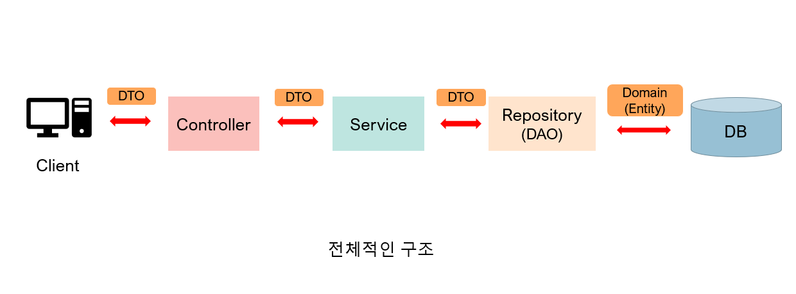
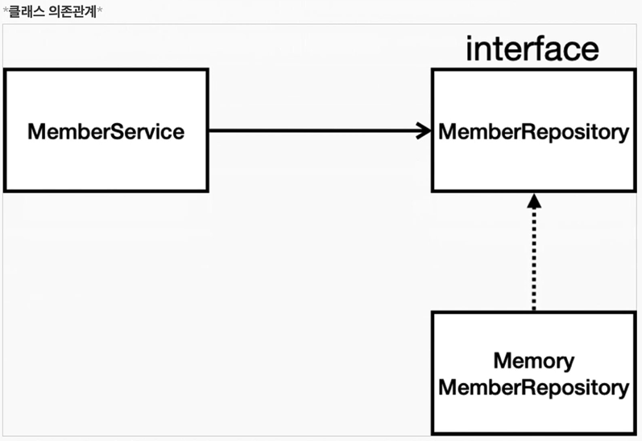

# 간단 백엔드 개발해보기

## 일반적인 JAVA 웹 애플리케이션 계층 구조
 

컨트롤러(node 라우터) => 서비스(node 컨트롤러) => 리포지토리(node DB스키마)  
이 세가지는 모두 '도메인 객체'와 연결된다.

이제 서비스로 회원ID와 이름만을 받아 회원가입하고 조회하는 아주 간단한 서비스를 만들어보자
(DB 뭐 쓸지는 안 정해진 시나리오)

## 회원 도메인과 리포지토리 만들기
위에 적어놓은 컨트롤러 -> 서비스 -> 리포지토리 구조에서 시작은 리포지토리 코드작성 부터 시작된다.
 
 

1. Member.java 만들기
2. MemberRepository.java 만들기
